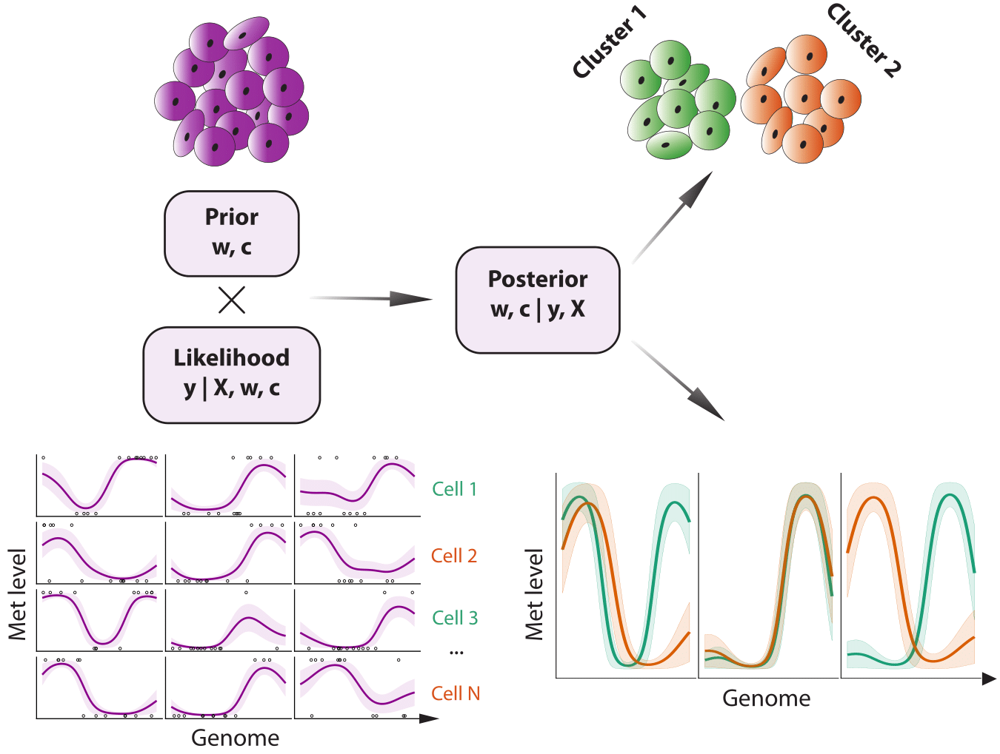

# Melissa: Bayesian clustering and imputation of single cell methylomes

New technologies enabling the measurement of DNA methylation at the single cell level are promising to revolutionise our understanding of epigenetic control of gene expression. Yet, intrinsic limitations of the technology result in very sparse coverage of CpG sites (around 5% to 20% coverage), effectively limiting the analysis repertoire to a semi-quantitative level.

__Melissa__ (MEthyLation Inference for Single cell Analysis), is a Bayesian hierarchical method to quantify spatially-varying methylation profiles across genomic regions from single-cell bisulfite sequencing data (scBS-seq). Melissa clusters individual cells based on local methylation patterns, enabling the discovery of epigenetic diversities and commonalities among individual cells. The clustering also acts as an effective regularisation method for imputation of methylation on unassayed CpG sites, enabling transfer of information between individual cells. 

<!---  -->

 

The probabilistic graphical representation of the Melissa model is shown below:

## Project structure

The code is structured as follows

* __analysis__ folder: Contains Rmd files for generating the final figures for synthetic and real data analysis. It also contains the `model/melissa_model.Rmd` file, which gives an extensive explanation of the model including mathematical derivations.
* __clustering-imputation__ folder: Contains all required scripts for performing clustering and imputation on real and synthetic data.
* __data__ folder: Contains annotation data and bulk profiles of the ENCODE data used for the simulation study.
* __lib__ folder: Contains the `Melissa` model implementation both in VB and Gibbs, also includes helper and plotting functions.
* __model-efficiency__ folder: Contains scripts for measuring model efficiency between VB and Gibbs implementations.
* __model-selection__ folder: Contains scripts for performing Bayesian model selection.
* __preprocessing__ folder: Contains scripts for pre-processing (synthetic and real datasets).
* __test__ folder: Contains test scripts for quickly running `Melissa`.

### Melissa dependence

Melissa depends heavily on the [BPRMeth package](https://academic.oup.com/bioinformatics/article-lookup/doi/10.1093/bioinformatics/bty129), which is available on 

`Bioconductor`: [http://bioconductor.org/packages/BPRMeth/](http://bioconductor.org/packages/BPRMeth/) and 

`Github`: [https://github.com/andreaskapou/BPRMeth](https://github.com/andreaskapou/BPRMeth).

## Citation
Kapourani, C.-A. and Sanguinetti, G. (2018). Melissa: Bayesian clustering and imputation of single cell methylomes, bioRxiv.
