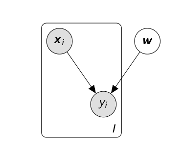
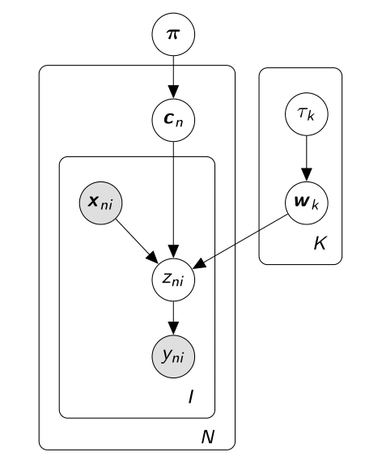

# Variational Inference

Consider we have a fully Bayesian probabilistic model in which we denote all observed variables by $\mathbf{X}$ and all latent variables by $\mathbf{Z}$. Note that the latent random variables $\mathbf{Z}$ include both parameters that might govern all the data, as found in Bayesian models, and latent variables that are "local" to individual data points. Our probabilistic model, specifies the joint density $p(\mathbf{X}, \mathbf{Z})$ and our goal is to compute the __posterior distribution__ $p(\mathbf{Z} | \mathbf{X})$. This conditional can be used to produce point or interval estimates of the latent variables, form predictive densities of new data, and using Bayes rule we can write it as
$$
p(\mathbf{Z} | \mathbf{X}) = \frac{p(\mathbf{X}, \mathbf{Z})}{p(\mathbf{X})} = \frac{p(\mathbf{X} | \mathbf{Z}) p(\mathbf{Z})}{p(\mathbf{X})}
$$
The denominator contains the __marginal likelihood__ (or model evidence) since we marginalize out the latent variables from the joint density
$$
p(\mathbf{X}) = \int p(\mathbf{X}, \mathbf{Z}) d\mathbf{Z}
$$
For many models, this evidence integral is unavailable in closed form or requires exponential time to compute. The evidence is what we need to compute the conditional density from the joint; this is why inference in such models is hard.

## The evidence lower bound (ELBO)
In variational inference, we specific a family $\mathcal{Q}$ of densities over the latent variables. Each $q(\mathbf{Z}) \in \mathcal{Q}$ is a __candidate approximation__ to the exact posterior density. Our goal is to find the best candidate, i.e. the one that __minimizes the Kulback-Leibler ($\mathcal{KL}$) divergence__ to the exact posterior. Hence, inference now amounts to solving the following optimization problem

$$
\begin{aligned}
q^{*}(Z) & = \underset{q(\mathbf{Z}) \in \mathcal{Q}} {\mathrm{argmin}}\; \mathcal{KL}(q(\mathbf{Z})\; || \; p(\mathbf{Z} | \mathbf{X}))
\end{aligned}
$$
Note that the complexity of the family $\mathcal{Q}$ determines the complexity of this optimization. Let us observe what is the $\mathcal{KL}$ divergence between these two distributions
$$
\begin{aligned}
\mathcal{KL}(q(\mathbf{Z})\; || \; p(\mathbf{Z} | \mathbf{X}))  & = - \int q(\mathbf{Z}) \ln\frac{p(\mathbf{Z} | \mathbf{X})}{q(\mathbf{Z})} d\mathbf{Z} \\
  & = \int q(\mathbf{Z})\ln q(\mathbf{Z}) d\mathbf{Z} - \int q(\mathbf{Z}) \ln p(\mathbf{Z} | \mathbf{X})d\mathbf{Z} \\
  & = \mathbb{E}_{q(\mathbf{Z})}\Big[ \ln q(\mathbf{Z})\Big] - \int q(\mathbf{Z}) \ln \frac{p(\mathbf{X}, \mathbf{Z})}{p(\mathbf{X})} d\mathbf{Z} \\
  & = \mathbb{E}_{q(\mathbf{Z})}\Big[\ln q(\mathbf{Z})\Big] + \int q(\mathbf{Z}) \ln p(\mathbf{X})d\mathbf{Z} - \int q(\mathbf{Z}) \ln p(\mathbf{X}, \mathbf{Z})d\mathbf{Z}\\
  & = \mathbb{E}_{q(\mathbf{Z})}\Big[\ln q(\mathbf{Z})\Big] + \mathbb{E}_{q(\mathbf{Z})}\Big[\ln p(\mathbf{X})\Big] - \mathbb{E}_{q(\mathbf{Z})}\Big[\ln p(\mathbf{X}, \mathbf{Z})\Big] \\
  & = \mathbb{E}_{q(\mathbf{Z})}\Big[\ln q(\mathbf{Z})\Big]  - \mathbb{E}_{q(\mathbf{Z})}\Big[\ln p(\mathbf{X}, \mathbf{Z})\Big] + \ln p(\mathbf{X}) \\
\end{aligned}
$$
This quantity is intractable to compute since it denends on the model evidence $\ln p(\mathbf{X})$, which however does not depend on the choice of the variational distribution $q(\mathbf{Z})$. Instead, we optimize an alternative objective function which is equivalent to the $\mathcal{KL}$ up to an added constant (i.e. the model evidence)
$$
\begin{aligned}
q_{ELBO}(Z) & = \mathbb{E}_{q(\mathbf{Z})}\Big[\ln p(\mathbf{X}, \mathbf{Z})\Big] - \mathbb{E}_{q(\mathbf{Z})}\Big[\ln q(\mathbf{Z})\Big]
\end{aligned}
$$
This function is called the __evidence lower bound (ELBO)__ and maximizing ELBO results in minizing the $\mathcal{KL}$ divergence defined above, since the ELBO is the negative $\mathcal{KL}$ plus the model evidence $\ln p(\mathbf{X})$. 

Examining the ELBO gives intuitions about the optimal variational density. We rewrite the ELBO as a sum of the expected log likelihood of the data and the $\mathcal{KL}$ divergence between the prior $p(\mathbf{Z})$ and $q(\mathbf{Z})$
$$
\begin{aligned}
q_{ELBO}(Z) & = \mathbb{E}_{q(\mathbf{Z})}\Big[\ln p(\mathbf{X}, \mathbf{Z})\Big] - \mathbb{E}_{q(\mathbf{Z})}\Big[\ln q(\mathbf{Z})\Big] \\
  & = \mathbb{E}_{q(\mathbf{Z})}\Big[\ln p(\mathbf{X} | \mathbf{Z})\Big] + \mathbb{E}_{q(\mathbf{Z})}\Big[\ln p(\mathbf{Z})\Big]  - \mathbb{E}_{q(\mathbf{Z})}\Big[\ln q(\mathbf{Z})\Big] \\
  & = \mathbb{E}_{q(\mathbf{Z})}\Big[\ln p(\mathbf{X} | \mathbf{Z})\Big] - \mathcal{KL} (q(\mathbf{Z}) \; ||\; p(\mathbf{Z}))\\
\end{aligned}
$$
The first term is an expected likelihood; it encourages densities that place their mass on configurations of the latent variables that explain the observed data. The second term is the negative divergence between the variational density and the prior; it encourages densities close to the prior. Thus, the variational objective mirrors the usual balance between likelihood and prior.

Another property of the ELBO is that it lower-bounds the (log) evidence, $\ln p(\mathbf{X}) \geq q_{ELBO}(Z)$ for any $q(\mathbf{Z})$. To see this notice that we can write the log evidence as
$$
\ln p(\mathbf{X}) = \mathcal{KL}(q(\mathbf{Z})\; || \; p(\mathbf{Z} | \mathbf{X})) + q_{ELBO}(Z)
$$
The bound then follows from the fact that $\mathcal{KL}(q \;||\;p) \geq 0$, and $q_{ELBO}(Z)$ achieves that bound only when the $\mathcal{KL}$ divergence vanishes, that is $\mathcal{KL}\big[q(\mathbf{Z})\;||\; p(\mathbf{Z} | \mathbf{X}) \big] = 0$. But, the $\mathcal{KL}(q \;||\;p)$ is zero if and only if $q = p$, which would lead to using the posterior distribution as our proposal. We can derive the same results through Jensen's inequality [Jordan et. al. (1999)](https://people.eecs.berkeley.edu/~jordan/papers/variational-intro.pdf). 

## The mean-field variational family
We now describe a variational family $\mathcal{Q}$, to complete the specification of the optimization problem. The complexity of the family determines the complexity of the optimization; it is more difficult to optimize over a complex family than a simple family. Here we focus on the __mean-field variational family__ where the latent variables are mutually independent and each governed by a distinct factor in the variational density. A generic member of the mean-field variational family is
$$
q(\mathbf{Z}) = \prod_{m=1}^{M} q_{m}(Z_{m})
$$
Each latent variable $Z_{m}$ is governed by its own variational factor, the density $q_{m}(Z_{m})$. We emphasize that the variational family is not a model of the observed data, indeed, the data $\mathbf{X}$ does not appear in the above equation. Instead, it is the ELBO, and the corresponding KL minimization problem, that connects the fitted variational density to the data and model. Also, notice we have not specified the parametric form of the individual variational factors. In principle, each can take on any parametric form appropriate to the corresponding random variable.

##  Coordinate ascent mean-field variational inference
Using the ELBO and the mean-field family, we have cast approximate conditional inference as an optimization problem. One of the most commonly used
algorithms for solving this optimization problem is coordinate ascent variational inference (CAVI) (Bishop, 2006). CAVI iteratively optimizes each factor of the mean-field variational density, while holding the others fixed. It climbs the ELBO to a local optimum.

Consider the $m^{th}$ latent variable $Z_{m}$. The complete conditional of $Z_{m}$ is its conditional density given all of the other latent variables in the
model and the observations, i.e. $p(Z_{m} | \mathbf{Z}_{-m}, \mathbf{X})$. Fix the other variational factors $q_{j}(Z_{j})$, $j \neq m$, then the log of the optimal solution for factor $q_{m}(Z_{m})$ is
$$
\ln q_{m}^{*}(Z_{m}) = \mathbb{E}_{j \neq m}\Big[\ln p(\mathbf{X}, \mathbf{Z})\Big] + \text{const}
$$
That is, the log of the optimal solution for factor $q_{m}$, is obtained simply by considering the log of the joint distribution over all hidden and observed variables and then taking the expectation w.r.t all of the other factors $\{q_{j}\}$ for $j \neq m$.

To obtain the form of $q^{*}_{m}(Z_{m})$ we exponentiate on both sides and normalize to obtain
$$
q_{m}^{*}(Z_{m}) = \frac{\exp\left\{ \mathbb{E}_{j \neq m}\Big[\ln p(\mathbf{X}, \mathbf{Z})\Big] \right\} }{\int\exp\left\{ \mathbb{E}_{j \neq m}\Big[\ln p(\mathbf{X}, \mathbf{Z})\Big] \right\}d Z_{m}}
$$

# Probit Regression Model
Suppose we have $I$ independent binary random variables $y_{i} \in \{0, 1\}$, where 
$$
y_{i} \sim \mathcal{B}ernoulli(y_{i} | \gamma_{i})
$$ 
We assume that the success probability $\gamma_{i}$ is related to a vector of covariates $\mathbf{x}_{i} \in \mathbb{R}^{D}$. Then, we define the probit regression model as 
$$
\begin{aligned}
\eta_{i}  & = \mathbf{w}^{T}\mathbf{x}_{i} \\
\mathbb{E}[y_{i}] & =  \gamma_{i} = g^{-1}(\eta_{i})
\end{aligned}
$$
where $\mathbf{w}$ represents a $D \times 1$ column vector of regression coefficients, and $g(\cdot)$ is the link function which allows to move from natural parameters $\eta_{i}$ to mean parameters $\gamma_{i}$. The __probit model__ is obtained if we define $g^{-1}(\cdot) = \Phi(\cdot)$, where $\Phi(\cdot)$ denotes the cumulative distribution function (cdf) of the standard normal distribution. The probabilistic graphical model is shown below
```{r, out.width = 300, out.height = 250, fig.retina = NULL, fig.align='center', echo=FALSE}

```

# Bayesian Probit Regression
In the Bayesian approach we define a prior distribution over the parameters $\mathbf{w}$. Then the Bayesian probit regression model becomes
$$ 
\begin{aligned}
y_{i}  & \sim \mathcal{B}ernoulli(y_{i} | \gamma_{i})  \\
\gamma_{i} & = \Phi(\eta_{i})\\
\eta_{i}  & = \mathbf{w}^{T}\mathbf{x}_{i} \\
\mathbf{w} & \sim p(\mathbf{w} | \mathcal{H})
\end{aligned}
$$
where $\mathcal{H}$ are (hyper)-parameters of the prior. Collecting $I$ response variables $\mathbf{y} \in \mathbb{R}^{I}$ and covariates $\mathbf{X}\in \mathbb{R}^{I\times D}$, the posterior distribution over the parameters is given by
$$
\begin{aligned}
p(\mathbf{w} | \mathbf{y}, \mathbf{X}) & \propto p(\mathbf{w} | \mathcal{H}) p(\mathbf{y} | \mathbf{X}, \mathbf{w}) =  p(\mathbf{w} | \mathcal{H}) \prod\limits_{i=1}^{I} p(y_{i} | \mathbf{x}_{i}, \mathbf{w})  \\
 & = p(\mathbf{w} | \mathcal{H}) \prod\limits_{i=1}^{I} \Phi\Big(\mathbf{w}^{T}\mathbf{x}_{i}\Big)^{y_{i}} \Big(1 - \Phi(\mathbf{w}^{T}\mathbf{x}_{i})\Big)^{(1-y_{i})}
\end{aligned}
$$

## Augmented Model
Performing inference for this model in the Bayesian framework is complicated by the fact that no conjugate prior $p(\mathbf{w} | \mathcal{H})$ exists for the parameters of the probit regression model. To overcome this problem, [Albert and Chib (1993)](http://www.tandfonline.com/doi/abs/10.1080/01621459.1993.10476321) augmented the original model with an additional __auxiliary latent variable__ that renders the conditional distributions of the model parameters equivalent to those under a Bayesian normal linear regression model with Gaussian noise.

Let us introduce $I$ independent latent variables $z_{i}$, where each $z_{i}$ follows a Gaussian distribution centered at $\mathbf{w}^{T}\mathbf{x}_{i}$, i.e. $z_{i} \sim \mathcal{N}(\mathbf{w}^{T}\mathbf{x}_{i}, 1)$. Then the augmented probit model has the following hierarchical structure
```{r, out.width = 250, out.height = 250, fig.retina = NULL, fig.align='center', echo=FALSE}
knitr::include_graphics("figures/bayes-augment-probit-model.png")
```

where
$$
\begin{aligned}
 \tau & \sim Gamma(\tau | \alpha_{0}, \beta_{0}) \\
 \mathbf{w} | \tau & \sim \mathcal{N}(\mathbf{w} | \pmb{\lambda}_{0}, \tau^{-1}\mathbf{I}) \\
 z_{i} | \mathbf{w} & \sim \mathcal{N}(z_{i} | \mathbf{w}^{T}\mathbf{x}_{i}, 1) \\
 y_{i} | z_{i} & = \begin{cases}
    1 & \; \text{if } z_{i} > 0\\
    0 & \; \text{if } z_{i} \leq 0\\
  \end{cases} \nonumber \\
\end{aligned}
$$
where $y_{i}$ is now deterministic conditional on the sign of the latent variable $z_{i}$. Hence, we formulate the original problem as a missing data problem where we have a normal regression model on the latent variables $z_{i}$ and the observed responses $y_{i}$ are incomplete in that we only observe whether $z_{i} > 0$ or $z_{i} \leq 0$. Note also that we now can put a conjugate Gaussian prior over parameters $\mathbf{w}$. A typical choice for the conjugate prior mean would be $\mathbf{\lambda}_{0} = 0$. Regarding the precision parameter $\tau$ either we can choose a small value to make it uninformative or we can introduce a Gamma prior as shown above.

Thus, the the joint distribution over all the variables is given by
$$
\begin{aligned} 
p(\mathbf{y}, \mathbf{z}, \mathbf{w}, \tau | \mathbf{X}) & = p(\mathbf{y}| \mathbf{z})  p(\mathbf{z}|\mathbf{w}, \mathbf{X}) p(\mathbf{w} | \tau) p(\tau)\\
   & = \left\{ \prod\limits_{i=1}^{I} p(y_{i} | z_{i}) p(z_{i}| \mathbf{x}_{i}, \mathbf{w}) \right\} p(\mathbf{w} | \tau)p(\tau)
\end{aligned}
$$
where
$$
 p(y_{i}| z_{i}) = \mathbf{1}(z_{i} > 0)^{y_{i}} \mathbf{1}(z_{i} \leq 0)^{(1 - y_{i})}
$$
where $\boldsymbol{1}(\cdot)$ is the indicator function, equal to $1$ if the quantities inside the function are satisfied, and $0$ otherwise. One way to compute the posterior is the Gibbs algorithm, see my previous post <http://rpubs.com/cakapourani/bayesian-binary-probit-model>. Here we will approximate the posterior using variational inference.


# Bayesian Probit Regression Mixture Model
Imagine that each of our observations comprises of a different probit regression model and our goal is to cluster together regression models with similar patterns, e.g. we have observed a single cell where we have methylation data for given genomic regions (the methylation data lie in the (0, 1) interval), and we want to group genomic regions that have similar patterns with respect to their methylation profiles.

Assume that each of our observations is generated from a corresponding latent variable $\mathbf{c}_{m}$ comprising a 1-of-K binary vector with elements $c_{mk}$ for $k = 1, ..., K$. The conditional distribution of $\mathbf{C}$, given the mixing coefficiens $\pmb{\pi}$, is given by
$$
p(\mathbf{C} | \pmb{\pi}) = \prod_{m=1}^{M}\prod_{k=1}^{K}\pi_{k}^{c_{mk}}
$$
The latent variables $\mathbf{C}$ will generate our latent observations $\mathbf{Z} \in \mathbb{R}^{M\times I_{m}}$, which in turn will generate our binary observations $\mathbf{Y} \in \mathbb{R}^{M\times I_{m}}$ depending on the sign of $\mathbf{Z}$ as explained above. The conditional distribution of the data ($\mathbf{Z}, \mathbf{Y}$), given the latent variables $\mathbf{C}$ and the component parameters $\mathbf{w}$ is

$$
\begin{align}
p(\mathbf{Y}, \mathbf{Z} | \mathbf{C}, \mathbf{w}, \mathbf{X}) & = p(\mathbf{Y} | \mathbf{Z}) p(\mathbf{Z} | \mathbf{C}, \mathbf{w}, \mathbf{X}) \\
   & =  \prod_{m=1}^{M}\prod_{k=1}^{K}\Big\{p(\mathbf{y}_{m} | \mathbf{z}_{m}) \;p(\mathbf{z}_{m} | \mathbf{w}_{k}, \mathbf{X}_{m})\Big\}^{c_{mk}} \\ 
   & = \prod_{m=1}^{M}\prod_{k=1}^{K}\Big\{\mathbf{1}(\mathbf{z}_{m} > 0)^{\mathbf{y}_{m}} \mathbf{1}(\mathbf{z}_{m} \leq 0)^{(\pmb{1} - \mathbf{y}_{m})}  \mathcal{N}(\mathbf{z}_{m} | \mathbf{X}_{m} \mathbf{w}_{k}, \mathbf{I}_{m})\Big\}^{c_{mk}} \\
\end{align}
$$
Next we introduce priors over the parameters. We choose a Dirichlet distribution over the mixing proportions $\pmb{\pi}$
$$
p(\pmb{\pi}) = \mathcal{D}ir( \pmb{\pi}| \pmb{\delta}_{0}) = C(\pmb{\delta}_{0})\prod_{k=1}^{K}\pi_{k}^{\delta_{0_{k}} - 1}
$$
where $C(\pmb{\delta}_{0})$ is the normalization constant for the Dirichlet distribution and we have chosen the same parameter $\delta_{0_{k}}$ for each of the mixture components to have a symmetrical Dirichlet distribution. We introduce an independent Gaussian prior over the coefficients $\mathbf{w}_{k}$ as we did in the Bayesian probit regression, i.e.
$$
\begin{aligned}
p(\mathbf{w} | \pmb{\tau}) & = \prod_{k=1}^{K} \mathcal{N}(\mathbf{w}_{k} | \mathbf{0}, \tau_{k}^{-1} \mathbf{I})
\end{aligned}
$$

We also introduce a prior distribution for the (hyper)-parameter $\pmb{\tau}$, which is the precision of the Gaussian prior over the weights and we assume that each cluster has its own precision parameter $\tau_{k}$, that is
$$
p(\pmb{\tau}) = \prod_{k=1}^{K} \mathcal{G}amma(\tau_{k} | \alpha_{0}, \beta_{0}) = \prod_{k=1}^{K} \frac{1}{\Gamma(\alpha_{0})}\beta_{0}^{\alpha_{0}}\tau_{k}^{\alpha_{0}-1}e^{-\beta_{0}\tau_{k}}
$$
<!-- p(\mathbf{Y} | \mathbf{Z}, \mathbf{C}, \pmb{\pi}, \mathbf{w}, \pmb{\tau}, \mathbf{X}) \;p(\mathbf{Z} | \mathbf{C}, \pmb{\pi}, \mathbf{w}, \pmb{\tau}, \mathbf{X}) \;p(\mathbf{C} | \pmb{\pi}, \mathbf{w}, \pmb{\tau},\mathbf{X}) \; p(\pmb{\pi} | \mathbf{w}, \pmb{\tau},\mathbf{X}) \;p(\mathbf{w} | \pmb{\tau},\mathbf{X}) \;p(\pmb{\tau}|\mathbf{X}) \\ -->
The joint distribution over all the variables is given by the following factorization.
$$
\begin{aligned}
p(\mathbf{Y}, \mathbf{Z}, \mathbf{C}, \pmb{\pi}, \mathbf{w}, \pmb{\tau} | \mathbf{X}) & = p(\mathbf{Y} | \mathbf{Z}) \; p(\mathbf{Z} | \mathbf{C}, \mathbf{w}, \mathbf{X}) \;p(\mathbf{C} | \pmb{\pi}) \;p(\pmb{\pi}) \;p(\mathbf{w} | \pmb{\tau}) \;p(\pmb{\tau})
\end{aligned}
$$
where the decomposition corresponds to the probabilistic graphical model shown below
```{r, out.width = 300, out.height = 320, fig.retina = NULL, fig.align='center', echo=FALSE}

```


# Melissa Model
Assume that we have $N (n = 1, ..., N)$ cells and for each cell we have a common set of $M (m = 1, ..., M)$ genomic regions, e.g. promoters or enhancers, and we are interested in both partitioning the cells in $K$ clusters and learning the methylation profiles of each genomic region. Each genomic region is a probit regression model, and cells that are grouped to the same cluster will have the share the same methylation pattern, i.e. the weights of the regression model for a given genomic region will be the same for the cells that are assigned to that cluster.

Assume that each of our cells is generated from a corresponding latent variable $\mathbf{c}_{n}$ comprising a 1-of-K binary vector with elements $c_{nk}$ for $k = 1, ..., K$. The conditional distribution of $\mathbf{C}$, given the mixing coefficiens $\pmb{\pi}$, is given by
$$
p(\mathbf{C} | \pmb{\pi}) = \prod_{n=1}^{N}\prod_{k=1}^{K}\pi_{k}^{c_{nk}}
$$
The latent variables $\mathbf{c}_{n}$ will generate our latent observations $\mathbf{Z}_{n} \in \mathbb{R}^{M\times I_{m}}$, which in turn will generate our binary observations $\mathbf{Y}_{n} \in \mathbb{R}^{M\times I_{m}}$ depending on the sign of $\mathbf{Z}$ as explained above. The conditional distribution of the data ($\mathbf{Z}, \mathbf{Y}$), given the latent variables $\mathbf{C}$ and the component parameters $\mathbf{W}$ is

$$
\begin{align}
p(\mathbf{Y}, \mathbf{Z} | \mathbf{C}, \mathbf{W}, \mathbf{X}) & = p(\mathbf{Y} | \mathbf{Z}) p(\mathbf{Z} | \mathbf{C}, \mathbf{W}, \mathbf{X}) \\
   & = \prod_{n=1}^{N}\prod_{k=1}^{K}\left\{\prod_{m=1}^{M}p(\mathbf{y}_{nm} | \mathbf{z}_{nm}) \;p(\mathbf{z}_{nm} | \mathbf{w}_{mk}, \mathbf{X}_{nm})\right\}^{c_{nk}} \\ 
   & = \prod_{n=1}^{N}\prod_{k=1}^{K}\left\{\prod_{m=1}^{M}\mathbf{1}(\mathbf{z}_{nm} > 0)^{\mathbf{y}_{nm}} \mathbf{1}(\mathbf{z}_{nm} \leq 0)^{(\pmb{1} - \mathbf{y}_{nm})}  \mathcal{N}(\mathbf{z}_{nm} | \mathbf{X}_{nm} \mathbf{w}_{mk}, \mathbf{I}_{nm})\right\}^{c_{nk}} \\
\end{align}
$$
Next we introduce priors over the parameters. We choose a Dirichlet distribution over the mixing proportions $\pmb{\pi}$
$$
p(\pmb{\pi}) = \mathcal{D}ir( \pmb{\pi}| \pmb{\delta}_{0}) = C(\pmb{\delta}_{0})\prod_{k=1}^{K}\pi_{k}^{\delta_{0_{k}} - 1}
$$
where $C(\pmb{\delta}_{0})$ is the normalization constant for the Dirichlet distribution and we have chosen the same parameter $\delta_{0_{k}}$ for each of the mixture components to have a symmetrical Dirichlet distribution. We introduce an independent Gaussian prior over the coefficients $\mathbf{w}_{mk}$ as we did in the Bayesian probit regression, i.e.
$$
\begin{aligned}
p(\mathbf{w}_{m} | \pmb{\tau}) & = \prod_{k=1}^{K} \mathcal{N}(\mathbf{w}_{mk} | \mathbf{0}, \tau_{k}^{-1} \mathbf{I})
\end{aligned}
$$
Each region is independent of the other regions, hence
$$
\begin{aligned}
p(\mathbf{W} | \pmb{\tau}) & = \prod_{m=1}^{M}\prod_{k=1}^{K} \mathcal{N}(\mathbf{w}_{mk} | \mathbf{0}, \tau_{k}^{-1} \mathbf{I})
\end{aligned}
$$
We also introduce a prior distribution for the (hyper)-parameter $\pmb{\tau}$, which is the precision of the Gaussian prior over the weights and we assume that each cluster has its own precision parameter $\tau_{k}$, that is
$$
p(\pmb{\tau}) = \prod_{k=1}^{K} \mathcal{G}amma(\tau_{k} | \alpha_{0}, \beta_{0}) = \prod_{k=1}^{K} \frac{1}{\Gamma(\alpha_{0})}\beta_{0}^{\alpha_{0}}\tau_{k}^{\alpha_{0}-1}e^{-\beta_{0}\tau_{k}}
$$
<!-- p(\mathbf{Y} | \mathbf{Z}, \mathbf{C}, \pmb{\pi}, \mathbf{w}, \pmb{\tau}, \mathbf{X}) \;p(\mathbf{Z} | \mathbf{C}, \pmb{\pi}, \mathbf{w}, \pmb{\tau}, \mathbf{X}) \;p(\mathbf{C} | \pmb{\pi}, \mathbf{w}, \pmb{\tau},\mathbf{X}) \; p(\pmb{\pi} | \mathbf{w}, \pmb{\tau},\mathbf{X}) \;p(\mathbf{w} | \pmb{\tau},\mathbf{X}) \;p(\pmb{\tau}|\mathbf{X}) \\ -->
The joint distribution over all the variables is given by the following factorization.
$$
\begin{aligned}
p(\mathbf{Y}, \mathbf{Z}, \mathbf{C}, \pmb{\pi}, \mathbf{w}, \pmb{\tau} | \mathbf{X}) & = p(\mathbf{Y} | \mathbf{Z}) \; p(\mathbf{Z} | \mathbf{C}, \mathbf{w}, \mathbf{X}) \;p(\mathbf{C} | \pmb{\pi}) \;p(\pmb{\pi}) \;p(\mathbf{w} | \pmb{\tau}) \;p(\pmb{\tau})
\end{aligned}
$$
where the decomposition corresponds to the probabilistic graphical model shown below
```{r, out.width = 300, out.height = 320, fig.retina = NULL, fig.align='center', echo=FALSE}
knitr::include_graphics("figures/melissa-model.png")
```


# Variational Bayes implementation
To apply the variational inference machinery, we will divide our parameters in four blocks, the latent variables $\mathbf{C}$, the latent observations $\mathbf{Z}$, the parameters $(\mathbf{W}, \pmb{\pi})$ and the parameter $\pmb{\tau}$. Hence, the __variational posterior__ distribution is given by the factorised expression
$$
q(\mathbf{Z}, \mathbf{C}, \pmb{\pi}, \mathbf{W}, \pmb{\tau}) = q(\mathbf{Z})\; q(\mathbf{C}) \;q(\pmb{\pi},\mathbf{W}) \;q(\pmb{\tau})
$$
It should be noted that this is the _only_ assumption that we need to make in order to obtain a tractable practical solution to our Bayesian mixture model. In particular, the functional form of the factors $q(\mathbf{Z})$, $q(\mathbf{C})$, $q(\pmb{\pi},\mathbf{W})$ and $q(\pmb{\tau})$ will be determinted automatically by optimization of the variational distribution. 


## Update factor $q(\mathbf{C})$
Let us consider the derivation of the update equation for the factor $q(\mathbf{C})$. The log of the optimized factor is given by
$$
\begin{align}
\ln q^{*}(\mathbf{C}) & = \mathbb{E}_{q(\mathbf{Z},\pmb{\pi},\mathbf{W},\pmb{\tau})}\Big[\ln p(\mathbf{Y}, \mathbf{Z}, \mathbf{C}, \pmb{\pi}, \mathbf{W}, \pmb{\tau} | \mathbf{X}) \Big] + \text{const} \\
  & = \mathbb{E}_{q(\mathbf{Z},\pmb{\pi},\mathbf{W},\pmb{\tau})}\left[\ln \Big\{ \underbrace{p(\mathbf{Y} | \mathbf{Z})}_{\text{const}} \; p(\mathbf{Z} | \mathbf{C}, \mathbf{W}, \mathbf{X}) \;p(\mathbf{C} | \pmb{\pi}) \; \underbrace{p(\pmb{\pi}) \;p(\mathbf{W} | \pmb{\tau}) \;p(\pmb{\tau})}_{\text{const}} \Big\}\right] + \text{const} \\
  & = \mathbb{E}_{q(\mathbf{Z}, \mathbf{W})}\Big[\ln\prod_{n=1}^{N}\prod_{k=1}^{K}\prod_{m=1}^{M}\mathcal{N}(\mathbf{z}_{nm} | \mathbf{X}_{nm} \mathbf{w}_{mk}, \mathbf{I}_{nm})^{c_{nk}}\Big] + \mathbb{E}_{q(\pmb{\pi})}\Big[\ln \prod_{n=1}^{N}\prod_{k=1}^{K}\pi_{k}^{c_{nk}} \Big] + \text{const} \\
  & = \sum_{n=1}^{N}\prod_{k=1}^{K}c_{nk}\;\sum_{m=1}^{M} \mathbb{E}_{q(\mathbf{z_{nm}}, \mathbf{w}_{mk})}\Big[\ln\mathcal{N}(\mathbf{z}_{nm} | \mathbf{X}_{nm} \mathbf{w}_{mk}, \mathbf{I}_{nm})\Big] + \sum_{n=1}^{N}\sum_{k=1}^{K}c_{nk}\;\mathbb{E}_{q(\pi_{k})}\Big[\ln\pi_{k} \Big] + \text{const} \\
  & = \sum_{n=1}^{N}\prod_{k=1}^{K} c_{nk}\; \left\{\sum_{m=1}^{M} \mathbb{E}_{q(\mathbf{z}_{nm}, \mathbf{w}_{mk})} \left[-\frac{1}{2}\Big(\mathbf{z}_{nm} - \mathbf{X}_{nm}\mathbf{w}_{mk}\Big)^{T}\Big(\mathbf{z}_{nm} - \mathbf{X}_{nm}\mathbf{w}_{mk}\Big) \right] + \mathbb{E}_{q(\pi_{k})}\Big[\ln\pi_{k} \Big] \right\} + \text{const} \\
  & = \sum_{n=1}^{N}\sum_{k=1}^{K}c_{nk}\;\ln\rho_{nk} + \text{const}
\end{align}
$$
where we have defined
$$
\ln\rho_{nk} = \sum_{m=1}^{M}\mathbb{E}_{q(\mathbf{z}_{nm}, \mathbf{w}_{mk})}\left[-\frac{1}{2}\Big(\mathbf{z}_{nm} - \mathbf{X}_{nm}\mathbf{w}_{mk}\Big)^{T}\Big(\mathbf{z}_{nm} - \mathbf{X}_{nm}\mathbf{w}_{mk}\Big) \right] + \mathbb{E}_{q(\pi_{k})}\Big[\ln\pi_{k} \Big]
$$
Note that we are only interested in the functional dependence on the variable $\mathbf{C}$, thus any terms that do not depend on $\mathbf{C}$ can be absorbed in the additive normalized constant. Taking the exponential on both sides we obtain
$$
q^{*}(\mathbf{C}) \propto \prod_{n=1}^{N}\prod_{k=1}^{K}\;\rho_{nk}^{c_{nk}}
$$
Requiring that this distribution be normalized, and noting that for each value of $n$ the quantities $c_{nk}$ are binary and sum to $1$ over all values of $k$, we obtain
$$
q^{*}(\mathbf{C}) = \prod_{n=1}^{N}\prod_{k=1}^{K}\;r_{nk}^{c_{nk}} \quad\quad\quad \text{where} \quad r_{nk} = \frac{\rho_{nk}}{\sum_{j=1}^{K}\rho_{nj}}
$$
We note that the functional form for the factor $q(\mathbf{C})$ takes the same functional form as the prior $p(\mathbf{C}|\pmb{\pi})$. For the discrete distribution $q^{*}(\mathbf{C})$ we have the standard result, which is the expected value of a __multinomial variable__
$$
\mathbb{E}_{q(c_{nk})}\big[c_{nk}\big] = r_{nk}
$$
for which we see that the quantities $r_{nk}$ are playing the role of responsibilities. Note that the optimal solution for $q^{*}(\mathbf{C})$ depends on moments evaluated w.r.t the distributions of other variables, and so again the variational update equations are coupled and must be solved iteratively.


## Update factor $q(\pmb{\tau})$
The log of the optimized factor is given by
$$
\begin{align}
\ln q^{*}(\mathbf{\tau}) & = \mathbb{E}_{q(\mathbf{Z}, \mathbf{C},\pmb{\pi},\mathbf{W})}\Big[\ln p(\mathbf{Y}, \mathbf{Z}, \mathbf{C}, \pmb{\pi}, \mathbf{W}, \pmb{\tau} | \mathbf{X}) \Big] + \text{const} \\
  & = \mathbb{E}_{q(\mathbf{Z},\mathbf{C},\pmb{\pi},\mathbf{W})}\left[\ln \Big\{ \underbrace{p(\mathbf{Y} | \mathbf{Z}) \; p(\mathbf{Z} | \mathbf{C}, \mathbf{W}, \mathbf{X}) \;p(\mathbf{C} | \pmb{\pi}) \; p(\pmb{\pi})}_{\text{const}} \;p(\mathbf{W} | \pmb{\tau}) \;p(\pmb{\tau}) \Big\}\right] + \text{const} \\
  & = \mathbb{E}_{q(\mathbf{W})}\Big[\ln p(\mathbf{W} | \pmb{\tau})\Big] + \ln p(\pmb{\tau}) + \text{const} \\
  & = \sum_{k=1}^{K}\sum_{m=1}^{M}\mathbb{E}_{q(\mathbf{w}_{mk})}\Big[\ln p(\mathbf{w}_{mk} | \tau_{k})\Big] + \sum_{k = 1}^{K}\ln p(\tau_{k}) + \text{const}
\end{align}
$$
Hence we observe that the right hand comprises a sum over $k$, i.e. each $\tau_{k}$ is independent of each other leading to the further factorization
$$
q(\pmb{\tau}) = \prod_{k=1}^{K}q(\tau_{k})
$$
We refer to these additional factorizations as __induced factorizations__ because they arise from an intersection between the factorization assumed in the variational posterior distribution and the conditional independence properties of the true joint distribution.

Hence,
$$
\begin{aligned}
\ln q^{*}(\tau_{k}) & = \sum_{m=1}^{M}\mathbb{E}_{q(\mathbf{w}_{mk})}\Big[\ln p(\mathbf{w}_{mk} | \tau_{k})\Big] + \ln p(\tau_{k}) + \text{const} \\
   & = \underbrace{\frac{MD}{2}\ln\tau_{k} - \frac{\tau_{k}}{2} \sum_{m=1}^{M}\mathbb{E}_{q(\mathbf{w}_{mk})}[\mathbf{w}_{mk}^{T} \mathbf{w}_{mk}]}_{\text{Gaussian PDF}} + \underbrace{(\alpha_{0} - 1)\ln\tau_{k} - \beta_{0}\tau_{k}}_{\text{Gamma PDF}}\\
   & = \underbrace{(\alpha_{0} + \frac{MD}{2} - 1)}_{\alpha_{k}\;\text{parameter}}\ln\tau_{k} - \Big(\underbrace{\beta_{0} + \frac{1}{2}\sum_{m=1}^{M}\mathbb{E}_{q(\mathbf{w}_{mk})}[\mathbf{w}_{mk}^{T}\mathbf{w}_{mk}]}_{\beta_{k}\;\text{parameter}}\Big)\tau_{k}
\end{aligned}
$$
which is the __log of the (unnormalized) Gamma distribution__, leading to
$$
\begin{aligned}
q^{*}(\tau_{k}) & = \mathcal{G}\text{amma}(\tau_{k} | \alpha_{k}, \beta_{k}) \\
\alpha_{k} & = \alpha_{0} + \frac{MD}{2} \\
\beta_{k} & = \beta_{0} + \frac{1}{2}\sum_{m=1}^{M}\mathbb{E}_{q(\mathbf{w}_{mk})}[\mathbf{w}_{mk}^{T}\mathbf{w}_{mk}]
\end{aligned}
$$


## Update factor $q(\pmb{\pi}, \mathbf{W})$
Now let us consider the factor $q(\pmb{\pi}, \mathbf{W})$ in the variational posterior distribution. Using again the general expression for the optimized factor we have
$$
\begin{align}
\ln q^{*}(\pmb{\pi}, \mathbf{W}) & = \mathbb{E}_{q(\mathbf{Z}, \mathbf{C},\pmb{\tau})}\Big[\ln p(\mathbf{Y}, \mathbf{Z}, \mathbf{C}, \pmb{\pi}, \mathbf{W}, \pmb{\tau} | \mathbf{X}) \Big] + \text{const} \\
  & = \mathbb{E}_{q(\mathbf{Z},\mathbf{C},\pmb{\tau})}\left[\ln \Big\{ \underbrace{p(\mathbf{Y} | \mathbf{Z})}_{\text{const}} \; p(\mathbf{Z} | \mathbf{C}, \mathbf{W}, \mathbf{X}) \;p(\mathbf{C} | \pmb{\pi}) \; p(\pmb{\pi}) \;p(\mathbf{W} | \pmb{\tau}) \; \underbrace{p(\pmb{\tau})}_{\text{const}} \Big\}\right] + \text{const} \\
  & = \underbrace{\mathbb{E}_{q(\mathbf{Z}, \mathbf{C})}\Big[\ln p(\mathbf{Z} | \mathbf{C}, \mathbf{W}, \mathbf{X})\Big] + \mathbb{E}_{q(\pmb{\tau})}\Big[\ln p(\mathbf{W} | \pmb{\tau}) \Big]}_{\ln q(\mathbf{w})} + \underbrace{\mathbb{E}_{q(\mathbf{C})} \Big[\ln p(\mathbf{C} | \pmb{\pi})\Big] + \ln p(\pmb{\pi})}_{\ln q(\pmb{\pi})} + \text{const} \\
\end{align}
$$
We observe that the right-hand side of this expression decomposes into a sum of terms involving only $\pmb{\pi}$ together with terms only involving $\mathbf{W}$, which implies that the variational posterior $q(\pmb{\pi}, \mathbf{W})$ factorizes to give $q(\pmb{\pi})q(\mathbf{W})$. Furthermore, the terms involving $\mathbf{W}$ themselves comprise a sum over $k$ (i.e. are independent between clusters), leading to the further factorization
$$
q(\pmb{\pi}, \mathbf{W}) = q(\pmb{\pi})\prod_{m=1}^{M}\prod_{k=1}^{K} q(\mathbf{w}_{mk}) 
$$


### Update factor $q(\pmb{\pi})$
Since this factor depends only on the latent variables $\mathbf{C}$ and parameters $\pmb{\pi}$, the optimal variational factor will be the same for any mixture model, irrespective of the observation model. Hence, we have
$$
\begin{align}
\ln q^{*}(\pmb{\pi}) & = \text{ln}\;p(\pmb{\pi}) + \mathbb{E}_{q(\mathbf{C})}\Big[\ln p(\mathbf{C} | \pmb{\pi})\Big] + \text{const} \\
  & = \underbrace{\ln C(\pmb{\delta}_{0})}_{\text{const}} + \sum_{k=1}^{K}\ln\pi_{k}^{\delta_{0_{k}}-1} + \sum_{k=1}^{K}\sum_{n=1}^{N}\underbrace{\mathbb{E}_{q(c_{nk})}\big[c_{nk}\big]}_{r_{nk}}\ln\pi_{k} + \text{const} \\
  & = \sum_{k=1}^{K}\ln\pi_{k}^{\delta_{0_{k}}-1} + \sum_{k=1}^{K}\sum_{n=1}^{N}{r_{nk}}\ln\pi_{k} + \text{const} \\
\end{align}
$$
Taking the exponential on both sides we observe that $q^{*}(\pmb{\pi})$ is a __Dirichlet distribution__
$$
\begin{align}
q^{*}(\pmb{\pi}) & = \prod_{k=1}^{K}\pi_{k}^{\delta_{0_{k}} - 1} + \prod_{k=1}^{K}\prod_{n=1}^{N}\pi_{k}^{r_{nk}} + \text{const} \\
  & = \prod_{k=1}^{K}\pi_{k}^{\delta_{0_{k}} - 1} + \prod_{k=1}^{K}\pi_{k}^{\sum_{n=1}^{N}r_{nk}} + \text{const} \\
  & = \prod_{k=1}^{K}\pi_{k}^{(\delta_{0_{k}} + \sum_{n=1}^{N}r_{nk} - 1)} \\
  & = \mathcal{D}ir(\pmb{\pi} | \pmb{\delta})
\end{align}
$$
where $\pmb{\delta}$ has components $\delta_{k}$ given by $\delta_{k} = \delta_{0_{k}} + \sum_{n=1}^{N}r_{nk}$.


### Update factor $q(\mathbf{W})$
Let us consider the derivation of the update equation for the factor $q(\mathbf{w}_{mk})$. The log of the optimized factor is given by
$$
\begin{align}
\ln q^{*}(\mathbf{w}_{mk}) & = \mathbb{E}_{q(\mathbf{Z},\mathbf{C})}\Big[\ln p(\mathbf{Z} | \mathbf{C}, \mathbf{w}_{mk}, \mathbf{X})\Big] + \mathbb{E}_{q(\tau_{k})}\Big[\ln p(\mathbf{w}_{mk} | \tau_{k})\Big] + \text{const} \\
  & = \sum_{n=1}^{N} \mathbb{E}_{q(c_{nk})}\big[c_{nk}\big]\; \mathbb{E}_{q(\mathbf{z}_{nm})}\Big[\ln\mathcal{N}(\mathbf{z}_{nm} | \mathbf{X}_{nm} \mathbf{w}_{mk}, \mathbf{I}_{nm})\Big] + \mathbb{E}_{q(\tau_{k})}\Big[\ln p(\mathbf{w}_{mk} | \tau_{k})\Big] + \text{const} \\
  & = \sum_{n=1}^{N} r_{nk} \;\mathbb{E}_{q(\mathbf{z}_{nm})}\left[-\frac{1}{2}\Big(\mathbf{z}_{nm} - \mathbf{X}_{nm}\mathbf{w}_{mk}\Big)^{T}\Big(\mathbf{z}_{nm} - \mathbf{X}_{nm}\mathbf{w}_{mk}\Big) \right] - \frac{1}{2} \mathbb{E}_{q(\tau_{k})}\big[\tau_{k}\big] \mathbf{w}_{mk}^{T}\mathbf{w}_{mk} + \text{const} \\
  & = \sum_{n=1}^{N} r_{nk} \;\mathbb{E}_{q(\mathbf{z}_{nm})} \left[-\frac{1}{2} \Big(\underbrace{\mathbf{z}_{nm}^{T} \mathbf{z}_{nm}}_{\text{const}} - 2\mathbf{w}_{mk}^{T} \mathbf{X}_{nm}^{T}\mathbf{z}_{nm} + \mathbf{w}_{mk}^{T} \mathbf{X}_{nm}^{T} \mathbf{X}_{nm} \mathbf{w}_{mk} \Big)\right] - \frac{1}{2} \mathbb{E}_{q(\tau_{k})}\big[\tau_{k}\big] \mathbf{w}_{mk}^{T}\mathbf{w}_{mk} + \text{const} \\
  & = \sum_{n=1}^{N} r_{nk} \left\{ \mathbf{w}_{mk}^{T} \mathbf{X}_{nm}^{T} \;\mathbb{E}_{q(\mathbf{z}_{nm})} \big[\mathbf{z}_{nm}\big] -\frac{1}{2} \mathbf{w}_{mk}^{T} \mathbf{X}_{nm}^{T} \mathbf{X}_{nm} \mathbf{w}_{mk} \right\} - \frac{1}{2} \mathbb{E}_{q(\tau_{k})}\big[\tau_{k}\big] \mathbf{w}_{mk}^{T}\mathbf{w}_{mk} + \text{const} \\
  & = \mathbf{w}_{mk}^{T}\sum_{n=1}^{N} r_{nk} \mathbf{X}_{nm}^{T} \;\mathbb{E}_{q(\mathbf{z}_{nm})} \big[\mathbf{z}_{nm}\big] - \frac{1}{2} \mathbf{w}_{mk}^{T}\sum_{n=1}^{N} \Big\{r_{nk} \mathbf{X}_{nm}^{T} \mathbf{X}_{nm} \Big\} \mathbf{w}_{mk} - \frac{1}{2} \mathbb{E}_{q(\tau_{k})}\big[\tau_{k}\big] \mathbf{w}_{mk}^{T}\mathbf{w}_{mk} + \text{const} \\
  & = \mathbf{w}_{mk}^{T}\sum_{n=1}^{N} r_{nk} \mathbf{X}_{nm}^{T} \;\mathbb{E}_{q(\mathbf{z}_{nm})} \big[\mathbf{z}_{nm}\big] - \frac{1}{2} \mathbf{w}_{mk}^{T}\left\{ \mathbb{E}_{q(\tau_{k})} \big[\tau_{k}\big]\mathbf{I} + \sum_{n=1}^{N} r_{nk} \mathbf{X}_{nm}^{T} \mathbf{X}_{nm} \right\}\mathbf{w}_{mk} + \text{const} \\
\end{align}
$$
Because this is a quadratic form, the distribution $q^{*}(\mathbf{w}_{mk})$ is a __Gaussian distribution__ and we can complete the square to identify the mean and covariance
$$
\begin{aligned}
q^{*}(\mathbf{w}_{mk}) & = \mathcal{N}(\mathbf{w}_{mk} | \pmb{\lambda}_{mk}, \mathbf{S}_{mk}) \\
\pmb{\lambda}_{mk} & = \mathbf{S}_{mk}\sum_{n=1}^{N}r_{nk}\mathbf{X}_{nm}^{T}\;\mathbb{E}_{q(\mathbf{z}_{nm})}\big[\mathbf{z}_{nm}\big] \\
\mathbf{S}_{mk} & = \left(\mathbb{E}_{q(\tau_{k})}\big[\tau_{k}\big]\mathbf{I} + \sum_{n=1}^{N}r_{nk} \mathbf{X}_{nm}^{T}\mathbf{X}_{nm}\right)^{-1}
\end{aligned}
$$
To __complete the square__ we make use of the fact that the exponent in a general Gaussian distribution $\mathcal{N}(\mathbf{x} | \pmb{\mu}, \pmb{\Sigma})$ can be written
$$
-\frac{1}{2}(\mathbf{x}-\pmb{\mu})^{T}\pmb{\Sigma}^{-1}(\mathbf{x}-\pmb{\mu}) = -\frac{1}{2}\mathbf{x}^{T}\pmb{\Sigma}^{-1}\mathbf{x} + \mathbf{x}^{T}\pmb{\Sigma}^{-1}\pmb{\mu} + \text{const}
$$
where _const_ denotes terms that are independent of $\mathbf{x}$, and we have made use of the symmetry of $\pmb{\Sigma}$.

## Update factor $q(\mathbf{Z})$
Finally, let us consider the derivation of the update equation for the factor $q(\mathbf{Z})$. From the graphical model we observe that the observations (i.e. different probit regressions) are independent of each other, which factorizes the variational factor as
$$
q(\mathbf{Z}) = \prod_{n=1}^{N}\prod_{m=1}^{M}\prod_{i=1}^{I_{nm}}q(z_{nmi})
$$
The log of the optimized factor assuming that the corresponding $y_{nmi} = 1$ is given by
$$
\begin{align}
\ln q^{*}(z_{nmi}) & = \mathbb{E}_{q(\mathbf{C},\pmb{\pi},\mathbf{W},\pmb{\tau})}\Big[\ln p(\mathbf{Y}, \mathbf{Z}, \mathbf{C}, \pmb{\pi}, \mathbf{W}, \pmb{\tau} | \mathbf{X}) \Big] + \text{const} \\
  & = \mathbb{E}_{q(\mathbf{C},\pmb{\pi},\mathbf{W},\pmb{\tau})}\left[\ln \Big\{ p(\mathbf{Y} | \mathbf{Z}) \; p(\mathbf{Z} | \mathbf{C}, \mathbf{W}, \mathbf{X}) \underbrace{\;p(\mathbf{C} | \pmb{\pi}) \; p(\pmb{\pi}) \;p(\mathbf{W} | \pmb{\tau}) \; p(\pmb{\tau})}_{\text{const}} \Big\}\right] + \text{const} \\
  & = \ln p(y_{nmi} | z_{nmi}) + \mathbb{E}_{q(\mathbf{c}_{n},\mathbf{w}_{m})} \left[\ln \prod_{k=1}^{K} \mathcal{N}(z_{nmi} | \mathbf{w}_{mk}^{T}\mathbf{x}_{nmi}, 1)^{c_{nk}}\right] + \text{const} \\
  & = y_{nmi}\ln\mathbf{1}(z_{nmi} > 0) + \underbrace{(1 - y_{nmi})\ln\mathbf{1}(z_{nmi} \leq 0)}_{0,\; \text{since}\;y_{nmi}=1} + \sum_{k=1}^{K} \mathbb{E}_{q(\mathbf{c}_{nk})} \big[c_{nk}\big] \;\mathbb{E}_{q(\mathbf{w}_{mk})} \Big[\ln \mathcal{N}(z_{nmi} | \mathbf{w}_{mk}^{T}\mathbf{x}_{nmi}, 1)\Big] + \text{const} \\
  & = y_{nmi}\ln\mathbf{1}(z_{nmi} > 0) + \sum_{k=1}^{K} r_{nk} \; \mathbb{E}_{q(\mathbf{w}_{mk})} \Big[-\frac{1}{2} (z_{nmi} - \mathbf{w}_{mk}^{T} \mathbf{x}_{nmi})^{2}\Big] + \text{const} \\
  & = \ln\mathbf{1}(z_{nmi} > 0) + \sum_{k=1}^{K}r_{nk} \left\{-\frac{1}{2} z_{nmi}^{2} + z_{nmi}\mathbb{E}_{q(\mathbf{w}_{mk})} \Big[\mathbf{w}_{mk}^{T}\Big]\mathbf{x}_{nmi} - \underbrace{\frac{1}{2}\mathbb{E}_{q(\mathbf{w_{mk}})} \Big[\mathbf{w}_{mk}^{T} \mathbf{x}_{nmi} \mathbf{x}_{nmi}^{T}\mathbf{w}_{mk}\Big]}_{\text{const}}\right\} + \text{const} \\
  & = \ln\mathbf{1}(z_{nmi} > 0) -\frac{1}{2} z_{nmi}^{2}\underbrace{\sum_{k=1}^{K}r_{nk}}_{\text{1}} + z_{nmi}\sum_{k=1}^{K}r_{nk} \; \mathbb{E}_{q(\mathbf{w}_{mk})}  \Big[\mathbf{w}_{mk}^{T}\Big]\mathbf{x}_{nmi} + \text{const}
\end{align}
$$
Exponentiating this quantity and setting $\mu_{nmi} = \sum_{k}^{K} r_{nk} \mathbb{E}_{q(\mathbf{w}_{mk})} \big[\mathbf{w}_{mk}^{T}\big]\mathbf{x}_{nmi}$ we obtain
$$
q^{*}(z_{nmi}) \propto \mathbf{1}(z_{nmi} > 0) \exp\left(-\frac{1}{2} z_{nmi}^{2} + z_{nmi}\mu_{nmi} \right)
$$
We observe that the optimized factor $q^{*}(z_{nmi})$ is an un-normalized __Truncated Normal distribution__, so we can complete the square to identify the mean and covariance
$$
q^{*}(z_{nmi}) = \begin{cases}
    \mathcal{TN}_{+}\left(z_{nmi} | \mu_{nmi}, 1 \right) & \; \text{if } y_{nmi} = 1\\
    \mathcal{TN}_{-}\left(z_{nmi} | \mu_{nmi}, 1 \right) & \; \text{if } y_{nmi} = 0\\
  \end{cases}
$$
where $\mathcal{TN}_{+}(\cdot)$ denotes the normal distribution truncated on the left tail to zero to contain only positive values, and $\mathcal{TN}_{-}(\cdot)$ denotes the normal distribution truncated on the right tail to zero to contain only negative values.

## Computing expectations
When deriving the optimized variational factors, the derivations involved expectations with respect to the variational distributions. These expectations are computed as follows

__Term $\mathbb{E}_{q(\mathbf{w})}\big[\mathbf{w}_{k}^{T}\big]$__: The factor $q(\mathbf{w}_{mk})$ is a Gaussian distribution $\mathcal{N}(\mathbf{w}_{mk} | \pmb{\lambda}_{mk}, \mathbf{S}_{mk})$ hence its expected value is
$$
\begin{align}
\mathbb{E}_{q(\mathbf{w}_{mk})}\big[\mathbf{w}_{mk}^{T}\big] = \pmb{\lambda}_{mk}
\end{align}
$$

__Term $\mathbb{E}_{q(\tau_{k})}\big[\tau\big]$__: The factor $q(\tau_{k})$ is a Gamma distribution $\mathcal{G}amma(\tau_{k} | \alpha_{k}, \beta_{k})$, hence its expected value is
$$
\mathbb{E}_{q(\tau_{k})}\big[\tau\big] = \frac{\alpha_{k}}{\beta_{k}}
$$

__Term $\mathbb{E}_{q(\mathbf{w}_{mk})}\big[\mathbf{w}_{mk}^{T}\mathbf{w}_{mk}\big]$__: The factor $q(\mathbf{w}_{mk})$ is a Gaussian distribution $\mathcal{N}(\mathbf{w}_{mk} | \pmb{\lambda}_{mk}, \mathbf{S}_{mk})$ hence we have
$$
\begin{align}
\mathbb{E}_{q(\mathbf{w}_{mk})}\big[\mathbf{w}_{mk}^{T}\mathbf{w}_{mk}\big] = \text{tr}\Big(\mathbb{E}_{q(\mathbf{w}_{mk})} \big[\mathbf{w}_{mk}\mathbf{w}_{mk}^{T} \big]\Big) = \text{tr}\Big(\pmb{\lambda}_{mk}\pmb{\lambda}_{mk}^{T} + \mathbf{S}_{mk}\Big) = \text{tr}\left(\pmb{\lambda}_{mk}\pmb{\lambda}_{mk}^{T}\right) + \text{tr}(\mathbf{S}_{mk}) = \pmb{\lambda}_{mk}^{T}\pmb{\lambda}_{mk} + \text{tr}(\mathbf{S}_{mk}) \\
\end{align}
$$

__Term $\mathbb{E}_{q(\pi_{k})}\big[\ln\pi_{k}\big]$__: The factor $q(\pi_{k})$ is a Dirichlet distribution $\mathcal{D}ir(\pi_{k} | \delta_{k})$ and from standard results (see Bishop book Eq. B.21) we obtain
$$
\mathbb{E}_{q(\pi_{k})}\big[\ln\pi_{k}\big] = \psi(\delta_{k}) - \psi(\hat{\delta}) \quad\quad \left(\text{where} \;\; \hat{\delta} = \sum_{k=1}^{K}\delta_{k} \right)
$$
where $\psi(\delta) \equiv \frac{d}{d\delta}\ln\Gamma(\delta)$ is the _digamma_ function.

__Term $\mathbb{E}_{q(c_{nk})}\big[c_{nk}\big]$__: The factor $q(c_{nk})$ is a Multinomial distribution $\mathcal{M}ultin(c_{nk} | r_{nk})$, hence its expected value is
$$
\mathbb{E}_{q(c_{nk})}\big[c_{nk}\big] = r_{nk}
$$

__Term $\mathbb{E}_{q(z_{nmi})}\big[z_{nmi}\big]$__: The factor $q(z_{nmi})$ is a Truncated Gaussian distribution as defined above, hence form standard results its expected value is
$$
\mathbb{E}_{q(z_{nmi})}\big[z_{nmi}\big] = \begin{cases}
    \mu_{nmi} + \phi_{nmi}/(1 - \Phi_{nmi}) & \; \text{if } y_{nmi} = 1\\
    \mu_{nmi} - \phi_{nmi}/\Phi_{nmi} & \; \text{if } y_{nmi} = 0\\
  \end{cases} 
$$
where $\phi_{nmi} = \phi(-\mu_{nmi})$ is the normal density and $\Phi_{nmi} = \Phi(-\mu_{nmi})$ is the cumulative distribution function (cdf) of the standard normal distribution.

__Term $\mathbb{E}_{q(\mathbf{z}_{nm},\mathbf{w}_{mk})}\left[-\frac{1}{2}\Big(\mathbf{z}_{nm} - \mathbf{X}_{nm}\mathbf{w}_{mk}\Big)^{T}\Big(\mathbf{z}_{nm} - \mathbf{X}_{nm}\mathbf{w}_{mk}\Big) \right]$__: The factor $q(\mathbf{w}_{mk})$ is a Gaussian distribution $\mathcal{N}(\mathbf{w}_{mk} | \pmb{\lambda}_{mk}, \mathbf{S}_{mk})$, hence we have
$$
\begin{align}
\mathbb{E}_{q(\mathbf{z}_{nm},\mathbf{w}_{mk})}\left[-\frac{1}{2}\Big(\mathbf{z}_{nm} - \mathbf{X}_{nm}\mathbf{w}_{mk}\Big)^{T}\Big(\mathbf{z}_{nm} - \mathbf{X}_{nm}\mathbf{w}_{mk}\Big) \right] & = \mathbb{E}_{q(\mathbf{z}_{nm}, \mathbf{w}_{mk})}\left[ -\frac{1}{2}\Big(\mathbf{z}_{nm}^{T}\mathbf{z}_{nm}- 2\mathbf{w}_{mk}^{T} \mathbf{X}_{nm}^{T}\mathbf{z}_{nm} + \mathbf{w}_{mk}^{T} \mathbf{X}_{nm}^{T} \mathbf{X}_{nm} \mathbf{w}_{mk} \Big)\right] \\
  & = -\frac{1}{2}\mathbb{E}_{q(\mathbf{z}_{nm})}\big[\mathbf{z}_{nm}^{T}\mathbf{z}_{nm}\big] + \mathbb{E}_{q(\mathbf{z}_{nm})} \Big[\mathbb{E}_{q(\mathbf{w}_{mk})} \left[\mathbf{w}_{mk}^{T}\right] \mathbf{X}_{nm}^{T}\mathbf{z}_{nm}\Big] -\frac{1}{2} \mathbb{E}_{q(\mathbf{w}_{mk})}\left[ \mathbf{w}_{mk}^{T} \mathbf{X}_{nm}^{T} \mathbf{X}_{nm} \mathbf{w}_{mk}\right] \\
  & = -\frac{1}{2}\mathbb{E}_{q(\mathbf{z}_{nm})}\big[\mathbf{z}_{nm}^{T}\mathbf{z}_{nm}\big] + \pmb{\lambda}_{mk}^{T} \mathbf{X}_{nm}^{T}\mathbb{E}_{q(\mathbf{z}_{nm})}\big[\mathbf{z}_{nm}\big] -\frac{1}{2} \text{tr}\left( \mathbf{X}_{nm}^{T} \mathbf{X}_{nm} \mathbb{E}_{q(\mathbf{w}_{mk})}\left[\mathbf{w}_{mk}\mathbf{w}_{mk}^{T}\right] \right) \\
  & = -\frac{1}{2}\sum_{i=1}^{I_{nm}}\mathbb{E}_{q(z_{nmi})}\big[z_{nmi}^{2}\big] + \sum_{i=1}^{I_{nm}}\mathbb{E}_{q(z_{nmi})}\big [z_{nmi}\big]\pmb{\lambda}_{mk}^{T} \mathbf{x}_{nmi} -\frac{1}{2} \text{tr}\left( \mathbf{X}_{nm}^{T} \mathbf{X}_{nm} \big(\pmb{\lambda}_{mk}\pmb{\lambda}_{mk}^{T} + S_{mk} \big)\right) \\
\end{align}
$$
where
$$
\begin{align}
\mathbb{E}_{q(z_{nmi})}\big[z_{nmi}^{2}\big] & = \mathbb{E}_{q(z_{nmi})}\big[z_{nmi}\big]^{2} + \mathbb{Var}_{q(z_{nmi})}\big[z_{nmi}\big]  \\
  & = \begin{cases}
       1 + \mu_{nmi} \Big(\mu_{nmi} + \phi_{nmi}/(1 - \Phi_{nmi}) \Big) & \; \text{if } y_{nmi} = 1\\
       1 + \mu_{nmi} \Big(\mu_{nmi} - \phi_{nmi}/\Phi_{nmi}\Big) & \; \text{if } y_{nmi} = 0\\
      \end{cases} \\
  & = 1 + \mu_{nmi} \;\mathbb{E}_{q(z_{nmi})}\big[z_{nmi}\big]
\end{align}
$$

## Variational lower bound

The variational lower bound $\mathcal{L}(q)$ (i.e. __evidence lower bound (ELBO)__ ) is given by
$$
\begin{aligned}
\mathcal{L}(q) & = \sum_{\mathbf{C}}\int\int\int\int q(\mathbf{Z}, \mathbf{C}, \pmb{\pi}, \mathbf{W}, \pmb{\tau}) \ln\left\{\frac{p(\mathbf{Y}, \mathbf{Z}, \mathbf{C}, \pmb{\pi}, \mathbf{W}, \pmb{\tau} |\mathbf{X})}{q(\mathbf{Z}, \mathbf{C}, \pmb{\pi}, \mathbf{W}, \pmb{\tau})}\right\}d\mathbf{Z}\; d \pmb{\pi}\;d\mathbf{W}\;d\pmb{\tau} \\
  & = \;\mathbb{E}_{q(\mathbf{Z},\mathbf{C}, \pmb{\pi}, \mathbf{W}, \pmb{\tau})}\Big[\ln p(\mathbf{Y}, \mathbf{Z}, \mathbf{C}, \pmb{\pi}, \mathbf{W}, \pmb{\tau}|\mathbf{X})\Big] - \mathbb{E}_{q(\mathbf{Z}, \mathbf{C}, \pmb{\pi}, \mathbf{W}, \pmb{\tau})}\Big[\ln q(\mathbf{Z}, \mathbf{C}, \pmb{\pi}, \mathbf{W}, \pmb{\tau})\Big] \\
  & = \; \mathbb{E}_{q(\mathbf{Z})}\Big[\ln p(\mathbf{Y} | \mathbf{Z})\Big] + \mathbb{E}_{q(\mathbf{Z}, \mathbf{C}, \mathbf{W})}\Big[\ln p(\mathbf{Z} | \mathbf{C}, \mathbf{W},\mathbf{X})\Big] + \mathbb{E}_{q(\mathbf{C}, \pmb{\pi})}\Big[\ln p(\mathbf{C} | \pmb{\pi})\Big] + \mathbb{E}_{q(\pmb{\pi})}\Big[\ln p(\pmb{\pi})\Big] + \mathbb{E}_{q(\mathbf{W}, \pmb{\tau})} \Big[\ln p(\mathbf{W} | \pmb{\tau})\Big] \\
  & \quad \qquad + \mathbb{E}_{q(\pmb{\tau}) }\Big[\ln p(\pmb{\tau})\Big]  - \mathbb{E}_{q(\mathbf{Z})}\Big[\ln q(\mathbf{Z})\Big] - \mathbb{E}_{q(\mathbf{C})}\Big[\ln q(\mathbf{C})\Big] - \mathbb{E}_{q(\pmb{\pi})}\Big[\ln q(\pmb{\pi})\Big] - \mathbb{E}_{q(\mathbf{W})}\Big[\ln q(\mathbf{W})\Big] - \mathbb{E}_{q(\pmb{\tau})} \Big[\ln q(\pmb{\tau})\Big]
\end{aligned}
$$

Note that the terms involving expectations of $\ln q(\cdot)$ distributions simply represent the negative information entropies $\mathbb{H}(\cdot)$ of those distributions. The various terms in the ELBO are evaluated to give
$$
\begin{align}
  \mathbb{E}_{q(\mathbf{Z})}\Big[\ln p(\mathbf{Y} | \mathbf{Z})\Big] & = \sum_{n=1}^{N}\sum_{m=1}^{M}\sum_{i}^{I_{nm}} \mathbb{E}_{q(z_{nmi})}\Big[y_{nmi}\ln \mathbf{1}(z_{nmi} > 0) + (1 - y_{nmi}) \ln \mathbf{1}(z_{nmi} \leq 0) \Big] \\
    & = \sum_{n=1}^{N}\sum_{m=1}^{M}\sum_{i}^{I_{nm}} \int_{-\infty}^{\infty} q(z_{nmi})\Big\{y_{nmi}\ln \mathbf{1}(z_{nmi} > 0) + (1 - y_{nmi}) \ln \mathbf{1}(z_{nmi} \leq 0) \Big\}\;d z_{nmi} \\
    & = \sum_{n=1}^{N}\sum_{m=1}^{M}\sum_{i}^{I_{nm}} \begin{cases}
      \int_{-\infty}^{\infty} q(z_{nmi}) \ln \mathbf{1}(z_{nmi} > 0)\; d z_{nmi} & \; \text{if } y_{nmi} = 1 \\
      \int_{-\infty}^{\infty} q(z_{nmi}) \ln \mathbf{1}(z_{nmi} \leq 0)\; d z_{nmi} & \; \text{if } y_{nmi} = 0 \\
    \end{cases} \\
    & = \sum_{n=1}^{N}\sum_{m=1}^{M}\sum_{i}^{I_{nm}} \begin{cases}
      \int_{-\infty}^{\infty} 0\; d z_{nmi} & \; \text{if } y_{nmi} = 1 \\
      \int_{-\infty}^{\infty} 0\; d z_{nmi} & \; \text{if } y_{nmi} = 0 \\
    \end{cases} \\
    & = 0 \\
\end{align}
$$
$$
\begin{align}
  \mathbb{E}_{q(\mathbf{Z}, \mathbf{C}, \mathbf{W})}\Big[\ln p(\mathbf{Z} | \mathbf{C}, \mathbf{W}, \mathbf{X})\Big] & = \sum_{n=1}^{N}\sum_{m=1}^{M}\sum_{k=1}^{K} \mathbb{E}_{q(c_{nk})} \big[c_{nk}\big]\mathbb{E}_{q(\mathbf{z}_{nm},\mathbf{w}_{mk})}\big[\ln\mathcal{N}(\mathbf{z}_{nm}|\mathbf{X}_{nm} \mathbf{w}_{mk}, \mathbf{I}_{nm}) \big] \\
    & = \sum_{n=1}^{N}\sum_{k=1}^{K} r_{nk}\sum_{m=1}^{M}\left\{-\frac{I_{nm}}{2}\ln \left(2\pi\right) - \frac{1}{2} \mathbb{E}_{q(\mathbf{z}_{nm},\mathbf{w}_{mk})} \left[ \left( \mathbf{z}_{nm} - \mathbf{X}_{nm} \mathbf{w}_{mk}\right)^{T}\left(\mathbf{z}_{nm} - \mathbf{X}_{nm} \mathbf{w}_{mk} \right) \right] \right\}\\
    & = \sum_{n=1}^{N}\Bigg\{ -\sum_{m=1}^{M}\frac{I_{nm}}{2}\ln \left(2\pi\right) -\frac{1}{2}\sum_{m=1}^{M}\mathbb{E}_{q(\mathbf{z}_{nm})} \big[\mathbf{z}_{nm}^{T}\mathbf{z}_{nm}\big] + \sum_{k=1}^{K} r_{nk}\sum_{m=1}^{M} \pmb{\lambda}_{mk}^{T} \mathbf{X}_{nm}^{T} \mathbb{E}_{q(\mathbf{z}_{nm})}\big[\mathbf{z}_{nm}\big] \\
    & \qquad\qquad\qquad\qquad\qquad\qquad -\frac{1}{2} \sum_{k=1}^{K} r_{nk}\sum_{m=1}^{M}\text{tr}\Big( \mathbf{X}_{nm}^{T} \mathbf{X}_{nm} \big(\pmb{\lambda}_{mk}\pmb{\lambda}_{mk}^{T} + S_{mk} \big)\Big)\Bigg\} 
\end{align}
$$

$$
\begin{align}
  \mathbb{E}_{q(\mathbf{C}, \pmb{\pi})}\Big[\ln p(\mathbf{C} | \pmb{\pi})\Big] & = \sum_{n = 1}^{N}\sum_{k=1}^{K} \mathbb{E}_{q(c_{nk})}\big [c_{nk}\big ]\mathbb{E}_{q(\pi_{k})}\big[\ln\pi_{k}\big] \\
    & = \sum_{n = 1}^{N}\sum_{k=1}^{K} r_{nk}\left\{\psi(\delta_{k}) - \psi(\hat{\delta})\right\} \\
 \mathbb{E}_{q(\pmb{\pi})}\Big[\ln p(\pmb{\pi})\Big] & = \ln C(\pmb{\delta}_{0}) + \sum_{k=1}^{K} (\delta_{0_{k}} - 1)\left\{\psi(\delta_{k}) - \psi(\hat{\delta})\right\} \\
\end{align}
$$

$$
\begin{align}
  \mathbb{E}_{q(\mathbf{W}, \pmb{\tau})}\Big[\ln p(\mathbf{W} | \pmb{\tau})\Big] & = \sum_{k=1}^{K}\sum_{m=1}^{M}\Bigg\{ \mathbb{E}_{q(\mathbf{w}_{mk}, \tau_{k})} \left[ -\frac{D}{2}\ln 2\pi - \frac{D}{2}\ln \tau_{k}^{-1} - \frac{1}{2\tau_{k}^{-1}} \mathbf{w}_{mk}^{T}\mathbf{w}_{mk}\right]\Bigg\}  \\
    & = \sum_{k=1}^{K}\Bigg\{ -\frac{MD}{2}\ln 2\pi + \frac{MD}{2}\mathbb{E}_{q(\tau_{k})} \big[\ln \tau_{k}\big] - \frac{1}{2}\mathbb{E}_{q(\tau_{k})} \big[\tau_{k}\big] \sum_{m=1}^{M}\mathbb{E}_{q(\mathbf{w}_{mk})} \big[\mathbf{w}_{mk}^{T}\mathbf{w}_{mk}\big]\Bigg\} \\
    & = \sum_{k=1}^{K}\Bigg\{ -\frac{MD}{2}\ln 2\pi + \frac{MD}{2}\Big(\psi(\alpha_{k}) - \ln \beta_{k}\Big) - \frac{\alpha_{k}}{2\beta_{k}} \sum_{m=1}^{M}\Big(\pmb{\lambda}_{mk}^{T}\pmb{\lambda}_{mk} + \text{tr}(\mathbf{S}_{mk})\Big)\Bigg\} \\
\end{align}
$$

$$
\begin{align}
  \mathbb{E}_{q(\pmb{\tau})}\Big[\ln p(\pmb{\tau})\Big] & = \sum_{k=1}^{K}\Bigg\{ \alpha_{0}\ln \beta_{0} + (\alpha_{0} - 1)\Big(\psi(\alpha_{k}) - \ln \beta_{k}\Big) - \beta_{0}\frac{\alpha_{k}}{\beta_{k}} - \ln\Gamma(\alpha_{0})\Bigg\} \\
  \mathbb{E}_{q(\mathbf{Z})}\Big[\ln q(\mathbf{Z})\Big] & = \sum_{n=1}^{N}\sum_{m=1}^{M}\sum_{i=1}^{I_{nm}} \mathbb{E}_{q(z_{nmi})}\left[ \ln \left(\mathcal{TN}_{+}(z_{nmi} | \mu_{nmi}, 1)^{y_{nmi}} \mathcal{TN}_{-}(z_{nmi} | \mu_{nmi}, 1)^{(1-y_{nmi})}\right)\right] \\
    & = \sum_{n=1}^{N}\sum_{m=1}^{M}\sum_{i=1}^{I_{nm}} \mathbb{E}_{q(z_{nmi})}\left[ \ln \left\{\mathcal{N}(z_{nmi} | \mu_{nmi}, 1) \left(\frac{1}{1 - \Phi_{nmi}}\right)^{y_{nmi}} \left(\frac{1}{\Phi_{nmi}}\right)^{(1-y_{nmi})}\right\}\right] \\
    & = \sum_{n=1}^{N}\sum_{m=1}^{M}\Bigg\{\mathbb{E}_{q(\mathbf{z}_{nm})}\Big[ \ln\mathcal{N}(\mathbf{z}_{nm} | \pmb{\mu}_{nm}, \mathbf{I}_{nm})\Big] - \sum_{i=1}^{I_{nm}}\bigg\{ y_{nmi}\ln \left(1-\Phi_{nmi}\right) + (1-y_{nmi})\ln\left(\Phi_{nmi}\right)\bigg\}\Bigg\} \\
    & = \sum_{n=1}^{N}\sum_{m=1}^{M}\Bigg\{-\frac{I_{nm}}{2}\ln2\pi -\frac{1}{2}\mathbb{E}_{q(\mathbf{z}_{nm})} \big[\mathbf{z}_{nm}^{T}\mathbf{z}_{nm}\big] + \pmb{\mu}_{nm}^{T} \mathbb{E}_{q(\mathbf{z}_{nm})}\big[\mathbf{z}_{nm}\big] -\frac{1}{2}\pmb{\mu}_{nm}^{T}\pmb{\mu}_{nm} \\
    & \qquad\qquad\qquad\qquad\qquad - \sum_{i=1}^{I_{nm}} \bigg\{ y_{nmi}\ln(1-\Phi_{nmi}) + (1-y_{nmi})\ln(\Phi_{nmi}) \bigg\}\Bigg\} \\
\end{align}
$$

$$
\begin{align}
  \mathbb{E}_{q(\mathbf{C})}\Big[\ln q(\mathbf{C})\Big] & = \sum_{n=1}^{N}\sum_{k=1}^{K}r_{nk}\ln r_{nk} \\
  \mathbb{E}_{q(\pmb{\pi})}\Big[\ln q(\pmb{\pi})\Big] & = \ln C(\pmb{\delta}) + \sum_{k=1}^{K}(\delta_{k} - 1)\left\{\psi(\delta_{k}) - \psi(\hat{\delta})\right\} \\
  \mathbb{E}_{q(\mathbf{W})}\Big[\ln q(\mathbf{W})\Big] & = \sum_{m=1}^{M}\sum_{k=1}^{K}\Big\{-\frac{1}{2}\ln |\mathbf{S}_{mk}| - \frac{D}{2}(1 + \ln 2\pi)\Big\} \\
  \mathbb{E}_{q(\pmb{\tau})}\Big[\ln q(\pmb{\tau})\Big] & = \sum_{k=1}^{K}\Big\{-\ln\Gamma(\alpha_{k}) + (\alpha_{k} - 1)\psi(\alpha_{k}) + \ln \beta_{k} - \alpha_{k}\Big\}
\end{align}
$$
where $\Phi_{nmi} \equiv \Phi(-\mu_{nmi})$, and $\Phi(\cdot)$ is the cumulative distribution function (cdf) of the standard normal distribution. The quantity $\mathbb{E}_{q(\mathbf{Z})}\Big[\ln p(\mathbf{Y} | \mathbf{Z})\Big]$ will always be zero w.r.t. to the variational factors, hence it does not contribute in the ELBO. Also, by inspecting expectations $\mathbb{E}_{q(\mathbf{Z},\mathbf{C}, \mathbf{W})}\Big[\ln p(\mathbf{Z} | \mathbf{C}, \mathbf{W}, \mathbf{X})\Big]$ and $\mathbb{E}_{q(\mathbf{Z})}\Big[\ln q(\mathbf{Z})\Big]$ some of the elements cancel out, thus we have 
$$
\begin{align}
\mathbb{E}_{q(\mathbf{Z}, \mathbf{C}, \mathbf{W})}\Big[\ln p(\mathbf{Z} | \mathbf{C}, \mathbf{W}, \mathbf{X})\Big] - \mathbb{E}_{q(\mathbf{Z})}\Big[\ln q(\mathbf{Z})\Big] & = \sum_{n=1}^{N}\sum_{m=1}^{M}\Bigg\{ -\frac{1}{2}\sum_{k=1}^{K}r_{nk}\; \text{tr}\left(\mathbf{X}_{nm}^{T}\mathbf{X}_{nm} \Big(\pmb{\lambda}_{mk}\pmb{\lambda}_{mk}^{T} + \mathbf{S}_{mk}\Big)\right) + \frac{1}{2} \pmb{\mu}_{nm}^{T}\pmb{\mu}_{nm} \\ 
  & \qquad\qquad\qquad + \sum_{i=1}^{I_{nm}}\bigg\{ y_{nmi}\ln \left(1-\Phi_{nmi}\right) + (1-y_{nmi})\ln\left(\Phi_{nmi}\right)\bigg\}\Bigg\} \\
\end{align}
$$

## Predictive density
The predictive density of a new observation $\mathbf{y}_{*}$ which will be associated with a latent variable $\mathbf{c}_{*}$, latent observation $\mathbf{z}_{*}$ and covariates $\mathbf{X}_{*}$ is given by
$$
\begin{align}
p(\mathbf{y}_{*} | \mathbf{X}_{*}, \mathbf{Y}, \mathbf{X}) & = \sum_{c}\int_{-\infty}^{\infty}\int\int\int p(\mathbf{y}_{*}, \mathbf{c}_{*}, \mathbf{z}_{*},  \pmb{\pi}, \mathbf{W}, \pmb{\tau} | \mathbf{X}_{*}, \mathbf{Y}, \mathbf{X}) \;d\pmb{\pi}\;d\pmb{\tau}\;d\mathbf{W}\;d\mathbf{z}_{*} \\
   & = \sum_{c}\int_{-\infty}^{\infty}\int\int\int p(\mathbf{y}_{*} | \mathbf{z}_{*}) p(\mathbf{z}_{*} | \mathbf{c}_{*}, \mathbf{W}, \mathbf{X}_{*}) p(\mathbf{c}_{*} | \pmb{\pi}) p(\pmb{\pi}, \mathbf{W}, \pmb{\tau} | \mathbf{Y}, \mathbf{X}) \;d\pmb{\pi}\;d\pmb{\tau}\;d\mathbf{W}\;d\mathbf{z}_{*} \\
   & = \sum_{k=1}^{K}\int_{-\infty}^{\infty}\int\int\int  p(\mathbf{y}_{*} | \mathbf{z}_{*}) p(\mathbf{z}_{*} | \mathbf{W}_{k}, \mathbf{X}_{*}) \pi_{k}\; p(\pmb{\pi}, \mathbf{W}, \pmb{\tau} | \mathbf{Y}, \mathbf{X}) \;d\pmb{\pi}\;d\pmb{\tau}\;d\mathbf{W}\;d\mathbf{z}_{*} \qquad\;\;(\text{Summation over}\; c) \\
   & = \sum_{k=1}^{K}\int_{-\infty}^{\infty}\int\int\int  p(\mathbf{y}_{*} | \mathbf{z}_{*}) p(\mathbf{z}_{*} | \mathbf{W}_{k}, \mathbf{X}_{*}) \pi_{k}\; q(\pmb{\pi}) q(\mathbf{W}_{k}) q(\tau_{k}) \;d\pmb{\pi}\;d\tau_{k}\;d\mathbf{W}_{k}\;d\mathbf{z}_{*} \qquad(\text{Variational approximation}) \\
   & = \sum_{k=1}^{K}\frac{\delta_{k}}{\hat{\delta}}\int_{-\infty}^{\infty}\int p(\mathbf{y}_{*} | \mathbf{z}_{*}) \mathcal{N}(\mathbf{z}_{*} | \mathbf{X}_{*}\mathbf{W}_{k}, \mathbf{I}_{n}) \mathcal{N}(\mathbf{W}_{k} | \pmb{\lambda}_{k}, \mathbf{S}_{k}) \;d\mathbf{W}_{k}\;d\mathbf{z}_{*} \qquad\qquad\qquad(\text{Integrate}\; \pmb{\pi}\;\text{and}\; \tau_{k})\\
   & = \sum_{k=1}^{K}\frac{\delta_{k}}{\hat{\delta}}\int_{-\infty}^{\infty} p(\mathbf{y}_{*} | \mathbf{z}_{*}) \mathcal{N}\left(\mathbf{z}_{*} | \mathbf{X}_{*}\pmb{\lambda}_{k},\;\mathbf{I}_{n} + \text{diag}\big(\mathbf{X}_{*} \mathbf{S}_{k} \mathbf{X}_{*}^{T}\big)\right) \;d\mathbf{z}_{*} \quad\qquad\qquad\quad\;(\text{Integrate}\; \mathbf{W}_{k}) \\
   & = \sum_{k=1}^{K}\frac{\delta_{k}}{\hat{\delta}}\begin{cases}
    \int_{0}^{\infty} \mathcal{N}\left(\mathbf{z}_{*} | \mathbf{X}_{*}\pmb{\lambda}_{k},\;\mathbf{I}_{n} + \text{diag}\big(\mathbf{X}_{*} \mathbf{S}_{k} \mathbf{X}_{*}^{T}\big)\right)\;dz & \; \text{where } \mathbf{y}_{*} = 1\\
    \int_{-\infty}^{0} \mathcal{N}\left(\mathbf{z}_{*} | \mathbf{X}_{*}\pmb{\lambda}_{k},\;\mathbf{I}_{n} + \text{diag}\big(\mathbf{X}_{*} \mathbf{S}_{k} \mathbf{X}_{*}^{T}\big)\right)\;dz & \; \text{where }\mathbf{y}_{*} = 0\\
  \end{cases} \\
  & = \sum_{k=1}^{K}\frac{\delta_{k}}{\hat{\delta}}\Phi \left(\frac{\mathbf{X}_{*}\pmb{\lambda}_{k}}{\left(\mathbf{I}_{n} + \text{diag}\big(\mathbf{X}_{*} \mathbf{S}_{k} \mathbf{X}_{*}^{T}\big)\right)^{1/2}} \right)^{y_{*}}\left(1 - \Phi \left(\frac{\mathbf{X}_{*}\pmb{\lambda}_{k}}{\left(\mathbf{I}_{n} + \text{diag}\big(\mathbf{X}_{*} \mathbf{S}_{k} \mathbf{X}_{*}^{T}\big)\right)^{1/2}}\right)\right)^{(1-y_{*})} \\
  & = \sum_{k=1}^{K}\frac{\delta_{k}}{\hat{\delta}}\mathcal{B}ernoulli\left(y_{*} \Big{|} \Phi \left(\frac{\mathbf{X}_{*}\pmb{\lambda}_{k}}{\left(\mathbf{I}_{n} + \text{diag}\big(\mathbf{X}_{*} \mathbf{S}_{k} \mathbf{X}_{*}^{T}\big)\right)^{1/2}}\right)\right)
\end{align}
$$

## Update equations summary
Below we summarize the update equations we obtain for the Variational Bayes, which we split to variational E and M steps to be consistent with the Expectation Maximization algorithm.

### Variational E-step
Compute responsibilities
$$
r_{nk} = \frac{\rho_{nk}}{\sum_{j=1}^{K}\rho_{nj}}
$$
where $\rho_{nk}$ is given by
$$
\rho_{nk} \propto \exp\left\{\left\{\psi(\delta_{k}) - \psi(\hat{\delta})\right\} + \sum_{m=1}^{M}\left\{- \frac{1}{2}\mathbb{E}_{q(\mathbf{z}_{nm})}\big[\mathbf{z}_{nm}^{T}\mathbf{z}_{nm}\big] + \pmb{\lambda}_{mk}^{T} \mathbf{X}_{nm}^{T}\mathbb{E}_{q(\mathbf{z}_{nm})}\big[\mathbf{z}_{nm}\big] -\frac{1}{2} \text{tr}\left( \mathbf{X}_{nm}^{T} \mathbf{X}_{nm} \big(\pmb{\lambda}_{mk}\pmb{\lambda}_{mk}^{T} + S_{mk} \big)\right)\right\} \right\}
$$
where
$$
\begin{align}
\mathbb{E}_{q(z_{nmi})}\big[z_{nmi}\big] & = \begin{cases}
    \mu_{nmi} + \phi_{nmi}/(1 - \Phi_{nmi}) & \; \text{if } y_{nmi} = 1\\
    \mu_{nmi} - \phi_{nmi}/\Phi_{nmi} & \; \text{if } y_{nmi} = 0\\
  \end{cases} \\
\mathbb{E}_{q(z_{nmi})}\big[z_{nmi}^{2}\big] & = 1 + \mu_{nmi} \;\mathbb{E}_{q(z_{nmi})}\big[z_{nmi}\big]
\end{align}
$$

### Variational M-step
Compute variational ditribution parameters
$$
\begin{align}
\pmb{\mu}_{nm} & = \mathbf{X}_{nm}\sum_{k}^{K} r_{nk} \;\pmb{\lambda}_{mk} \\
\delta_{k} & = \delta_{0_{k}} + \sum_{n=1}^{N}r_{nk} \\
\pmb{\lambda}_{mk} & = \mathbf{S}_{mk}\sum_{n=1}^{N}r_{nk}\mathbf{X}_{nm}^{T} \mathbb{E}_{q(\mathbf{z}_{nm})} \big[\mathbf{z}_{nm}\big] \\
\mathbf{S}_{mk} & = \left(\frac{\alpha_{k}}{\beta_{k}}\mathbf{I} + \sum_{n=1}^{N}r_{nk} \mathbf{X}_{nm}^{T} \mathbf{X}_{nm}\right)^{-1} \\
\alpha_{k} & = \alpha_{0} + \frac{MD}{2} \\
\beta_{k} & = \beta_{0} + \frac{1}{2}\sum_{m=1}^{M}\left(\pmb{\lambda}_{mk}^{T}\pmb{\lambda}_{mk} + \text{tr}(\mathbf{S}_{mk})\right)\\
\end{align}
$$


# Conclusions
This tutorial-like document showed how we can perform Variational Bayes for the Melissa model.

If you found this document useful, check my [homepage](http://homepages.inf.ed.ac.uk/s1263191/) at the University of Edinburgh for links to other tutorials.

***
